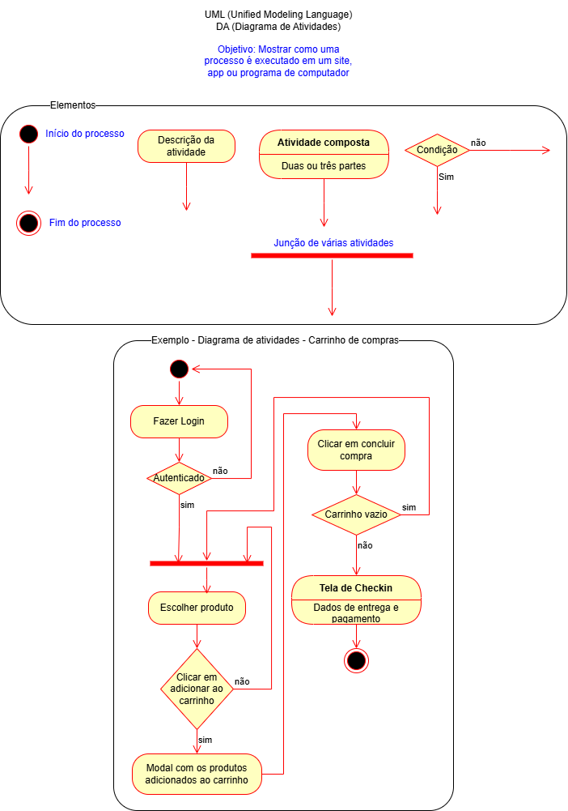

# Login - auth
## Dupla com a [CrislaineL](https://github.com/CrislaineL)
## Explicação do código.

# Server ⤵
Resumo Geral

- Lê variáveis do .env (com dotenv).
- Inicializa um servidor Express.
- Usa middlewares para ler JSON.
- Separa rotas em arquivos (login.js, posts.js).
- Escuta requisições HTTP na porta 3000.

# Pasta middlewares ⤵
## Arquivo auth.js ⤵
- Esse código é um middleware de autenticação JWT (JSON Web Token) usado em aplicações Node.js com Express. Ele verifica se a requisição tem um token válido e, se sim, permite que o usuário acesse rotas protegidas.
- É uma função chamada validate, que verifica:
- Se há um token JWT no cabeçalho da requisição (Authorization).
- Se o token é válido.
- Se for válido, adiciona os dados do usuário à requisição.
- Se não for válido ou estiver ausente, bloqueia o acesso.
- Importa a biblioteca jsonwebtoken, usada para criar e verificar tokens JWT.
- Ela fornece os métodos:
jsonwebtoken.sign(payload, secret) → para criar um token.
jsonwebtoken.verify(token, secret) → para verificar um token.
## Esse middleware:
  - Verifica a presença e validade de um token JWT.
  - Rejeita a requisição se o token estiver ausente ou inválido.
  - Se for válido, anexa os dados do usuário e permite o acesso à rota.

# Pasta data ⤵
## posts.js ⤵
- Exporta um array chamado data, que contém uma lista de objetos representando artigos ou postagens de blog.
- Cada objeto possui informações como título, resumo, data, número de visualizações e curtidas.
  ## O que é data?
  - É um array de objetos JavaScript com a seguinte estrutura para cada item:
  ```bash
    {
  id: Number,        // Identificador único
  title: String,     // Título do artigo
  summary: String,   // Resumo ou descrição curta
  date: String,      // Data de publicação (no formato YYYY-MM-DD)
  views: Number,     // Quantidade de visualizações
  likes: Number      // Quantidade de curtidas
    }
  ```

  ## Exemplo de item no array ⤵
 ```bash
  {
  "id": 3,
  "title": "Entenda o que é Inteligência Artificial Generativa",
  "summary": "Um guia simples sobre o que é IA generativa e como ela funciona.",
  "date": "2025-05-01",
  "views": 1576,
  "likes": 312
  }
  ```
## O que faz module.exports = data;?
⮩ Essa linha exporta o array data para que ele possa ser usado em outros arquivos do projeto Node.js.
  ## Exemplo de uso:
  ```bash
  const posts = require('./caminho/para/esse/arquivo');
  console.log(posts[0].title); // "Como ser mais produtivo em 2025"
  ```

## Possíveis usos desse data ⤵
- Criar uma rota /posts que retorne todos os posts.
- Buscar um post por id
- Ordenar os posts por data, visualizações ou curtidas.
- Exibir os posts mais populares ou mais recentes.

# Controllers ⤵
## login.js ⤵
 - Esse código define uma função Login que simula o processo de autenticação de um usuário e gera um token JWT quando o login é bem-sucedido.
 - jsonwebtoken: biblioteca usada para gerar e verificar tokens JWT.
 - crypto: módulo nativo do Node.js usado aqui para gerar um ID aleatório com randomUUID().
 - Payload: dados do usuário (ID aleatório, nome e avatar).
 - Chave secreta (process.env.SECRET_JWT): define a segurança do token.
 - Validade: 2 minutos (expiresIn: "2min").
 - Esse código:
   - Simula login com e-mail e senha fixos.
   - Gera um token JWT com ID, nome e avatar.
   - Retorna o token se o login for bem-sucedido.
   - Usa um segredo (SECRET_JWT) para assinar o token.
 
## posts.js ⤵
 Resumo ⤵
 - Esse arquivo contém um array de objetos representando posts de blog ou artigos. Cada post tem informações como:
 - id: identificador único (número)
 - title: título do post
 - summary: pequeno resumo do conteúdo
 - date: data de publicação
 - views: número de visualizações
 - likes: número de curtidas
# Routes ⤵
## login.js ⤵

 - O login.js cria uma rota que responde a requisições POST no /login, chamando a função do controlador de login.
 -Importancia: É importante porque permite que os usuários se autentiquem no sistema, permitindo que apenas pessoas expecificadas possam acessar informações confidencias. A utilização correta do login é essencial para a segurança e integridade.

## posts.js ⤵
 - O posts.js define uma rota que responde a requisições GET no  /posts, utilizando um middleware de validação para autenticar o usuário antes de chamar a função do controlador de posts.
 -Importancia:É importante porque assegura que apenas usuários autenticados possam acessar informações sensíveis, como posts, promovendo a segurança e a privacidade dos dados no sistema .
  
# Imagem Diagrama de Atividades


# Testes no Insomnia
## Pra testar 
- No login (POST)
```bash
http://localhost:3000/login
```
comandos BODY
```bash
{
   "user":"usuario@gmail.com",
	 "psw":"a1b2@b3c4"
  }
```
- Quando clicar em Sen seu Token ira aparecer

Posts (GET)
Em header adicione manualmente, Clique em + add ou no botão + e preencha assim 

| Chave         | Valor                          |
|---------------|--------------------------------|
| Authorization | Bearer **cole seu token aqui** |


# Importante:
- Deve ser Bearer + espaço + token.
- Não coloque aspas no valor.
- Não use aba "Auth" do Insomnia, use só a aba “Headers”.
- Agora clique em Send e sua requisição deve funcionar.


